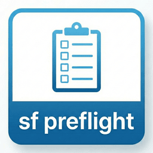

# SF Preflight

**Quiet, accurate environment checks and optional project setup for Salesforce development in VS Code.**

## Features

- **🔍 Setup Report** - Blockers, warnings, and recommendations in one place (status bar click)
- **🤫 Quiet by default** - Startup is silent; toast only for real blockers, with real snooze
- **📦 Salesforce Extension Pack** - Detects missing pack / core extensions (severity configurable)
- **☕ Java for Apex** - Checks `salesforcedx-vscode-apex.java.home`, `JAVA_HOME`, then PATH; can set the VS Code setting for you
- **☁️ Salesforce CLI** - Install/update commands match Homebrew, npm, or installer
- **🔐 Org auth (soft)** - Best-effort default org check via `sf org list`
- **📝 Optional tooling** - Prettier packages and code-analyzer are recommendations, never red errors
- **⚙️ Explicit project setup** - Preview which files will be created; never silent-merge `.vscode/settings.json`
- **⚡ Smart caching** - Healthy environments cached 24h (optional gaps do not bust the cache)

## Severity model

| Level | Status bar | Examples |
| --- | --- | --- |
| **Blocker** | Red | Node missing, SF CLI missing, Java missing when Apex extension is present |
| **Warning** | Yellow | Extension Pack missing (default), no default org, Node/Java below minimum |
| **Info** | Green | Missing Prettier packages, code-analyzer, JDK 21 recommendation |

## Status bar

Compact **SF** item on the right. Click opens the **Setup Report** (not a wall of toasts).

Full multi-line results always go to **View → Output → SF Preflight**.

## Recommended Setup

Run **SF Preflight: Apply Recommended Setup** to preview and create missing files only:

- `.prettierrc` / `.prettierignore`
- `.editorconfig`
- `.gitignore`
- `.vscode/settings.json` (**create if missing only** — never merges into existing settings)
- `cspell.json` + Salesforce dictionary (if Code Spell Checker is installed)

Force re-provision is under Advanced, multi-selects targets, and creates timestamped backups.

## Commands

| Command | Description |
| --- | --- |
| `SF Preflight: Open Setup Report` | Primary report UI |
| `SF Preflight: Check Environment Health` | Re-run checks |
| `SF Preflight: Fix Environment Issues` | Copyable fixes / docs |
| `SF Preflight: Apply Recommended Setup` | Create missing config (preview) |
| `SF Preflight: Force Re-provision Configuration` | Overwrite with backups |
| `SF Preflight: Check Java / Node / SF CLI` | Focused checks |
| `SF Preflight: Show Project Info` | `sfdx-project.json` summary |
| `SF Preflight: Show Logs` | Output channel |

## Settings

| Setting | Default | Description |
| :--- | :--- | :--- |
| `sfPreflight.runHealthCheckOnStartup` | `true` | Silent startup check (blockers only for toasts) |
| `sfPreflight.showStatusBar` | `true` | Compact SF status item |
| `sfPreflight.verboseNotifications` | `false` | Success / recommendation toasts |
| `sfPreflight.checks.extensionPack` | `warning` | `warning` \| `blocker` \| `off` |
| `sfPreflight.checks.codeAnalyzer` | `recommended` | `recommended` \| `off` |
| `sfPreflight.checks.orgAuth` | `true` | Soft default-org check |
| `sfPreflight.provisioning.runOnStartup` | `false` | Auto-create missing files on open |
| `sfPreflight.provisioning.*` | `true` | Per-file-type enable flags |
| `sfPreflight.provisioning.templates.*` | (bundled) | Override templates |

## Installation

Install from the [VS Code Marketplace](https://marketplace.visualstudio.com/items?itemName=avidev9.sf-preflight) or search for "SF Preflight" in Extensions.

Requires **VS Code 1.85+**.

## License

MIT
